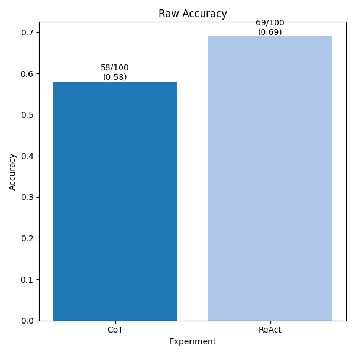
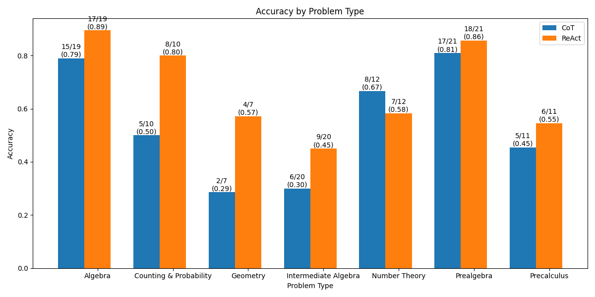

# CoT Hackathon: What might O1 be?
Implemented a sympy tool for a ReAct agent to do symbolic manipulation, evaluated on the MATH dataset.
Benchmarked against CoT. Results:





See the [REPORT](docs/REPORT.md) for more details.

## TODO: Prerequisites
- Python 3.x
- Required Python packages (install via `requirements.txt` if available)

## Installation

1. Clone the repository:
   
2. TODO: Install the required packages (TODO):
   ```bash
   pip install -r requirements.txt
   ```

3. In `model_setup.py` `setup_chat_model`, adjust so that it returns a LangChain wrapped chat model of your choice

## Usage

### Running the Evaluation

To run the main evaluation loop, execute the following command for ReAct:

```bash
python main.py
```

and the below for zero shot CoT

```bash
python main.py --strategy zero_shot
```
### Postprocess
Move the results from the `log_files` directory to the `results` directory, and run the postprocessing script:

```bash
python scripts/postprocess.py
```

for the figs n comparisons

### Configuration Options

- **Model Options**: 
  - `option`: Choose between `"remote"` or `"local"` to specify the model source.
  - `strategy`: Choose between `"zero_shot"` or `"react"` to specify the reasoning strategy.

### Local Model Serving

For local models, serve via vllm:

```bash
vllm serve --model meta-llama/Llama-3.2-1B-Instruct \
            --chat-template chat_templates/tool_chat_template_llama3.2_json.jinja \
            --enable-auto-tool-choice --tool-call-parser llama3_json
```


## Project Structure

- `main.py`: Contains the main evaluation loop and setup functions.
- `cognitive_base/utils/`: Utility functions for model construction and caching.
- `utils/`: Additional utility functions for processing solutions and evaluation.
- `agent_tools.py`: Where the sympy tool is defined
- `prompts.py`: Contains prompt templates for different strategies.
- `results/`: Directory for storing results for CoT and ReAct with trajectories.
- `docs/`: Documentation and reports.
