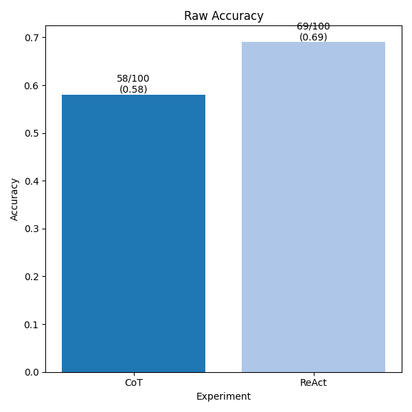
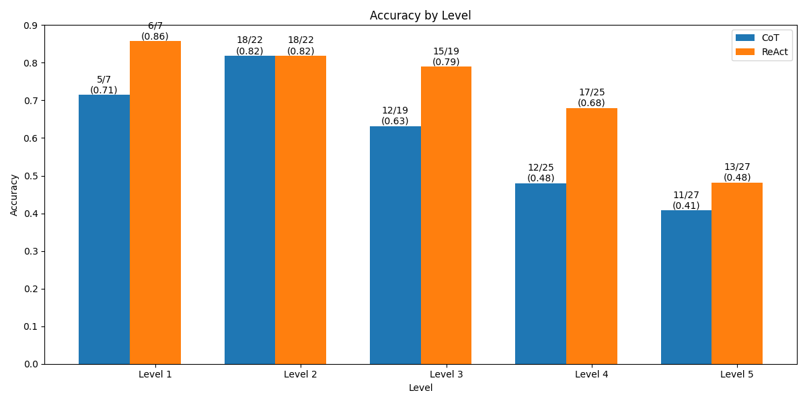
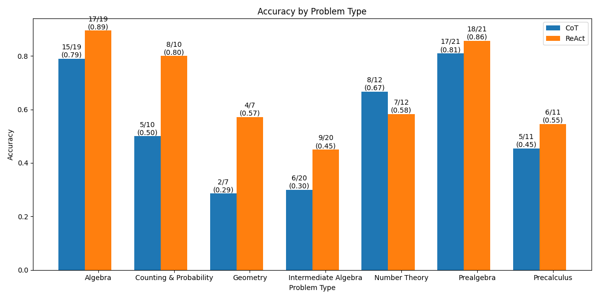

# CoT Hackathon: What might O1 be?
Eval on the [MATH](https://huggingface.co/datasets/lighteval/MATH) Dataset. Starter code [here](https://github.com/LeonGuertler/CoT-Hackathon)

## Clues
- From their ['making of' video](https://www.youtube.com/watch?v=tEzs3VHyBDM), the main innovation is scaling **test time** compute. 
 - Test time compute is not constant because problems have variable difficulty (eg basic math vs complex algebraic manipulation)
- `[1]` suggests that optimizing for the reasoning process works better than optimizing for the outcome
- Potential tool use seen in o1 on chatgpt (writes python code)

## Motivation
- Some papers suggest LLM reasoning `[3]` and planning `[4]` is largely attributable to memorization -- equipping LLMs with symbolic tools for Math can help mitigate this. `[3]` showed that on GSM8K, "LLMs exhibit noticeable variance when responding to different instantiations of the same question"
- esp with weaker models, innate reasoning not as strong but can be improved with the right external info
    - eg USACO-bench `[5]` showed that right retrieved info can boost weaker models performance due to analogical reasoning
- Research community realizing the importance of verifiers -- Ultimate verifier is still execution!

## Approach
- ReAct with sympy tool for tool use hypothesis
- LATS `[2]` or something equivalent style MCTS decision process (could not finish in time) for variable compute hypothesis

## Results
### Baselines
- Llama 3.2 1B 4-shot CoT pass@1 23.35% (full 5k test set)
    - paused due to engineering overhead esp having to wrangle with the special python code token which it confuses with function calling
- 4o-mini zero shot CoT pass@1 (70.2% on full test set 5k claimed by openai, experimentally got 58/100 subsample)


### ReAct with sympy tool
- 4o-mini zero shot ReAct pass@1 69/100 subsample improves over CoT by a relative 19%



#### By difficulty level


In general the accuracy declines by difficulty as expected.

Across all levels, ReAct with sympy tool performs better than CoT.

#### By problem type



Models tend to perform poorly at geometry (seems reasonable as its a language model), intermediate algebra and precalculus. Latter 2 might be due to harder topic in general, but surprisingly number theory is not as hard for them (need to investigate more).

Largest boost from ReAct with tool is on counting and probability and geometry. Smallest boost (rather, decline) on number theory

## Discussion

### Qualitative analysis
- Sometimes model does not want to use tool and just replies directly
- Problem 2553: Too many iterations (break at 25th iter) (TODO: adjust logging so can capture intermediate steps)

#### 4o-mini can fallback to Python code when tool error
Problem 3552

This also shows that we are still partially reliant on model being able to know Sympy syntax properly, and be able to reason in Python code
```
================================== Ai Message ==================================

To determine how many of the first 2007 positive integers have palindromic representations in base 3, we need to follow these steps:

1. **Convert the range of integers (1 to 2007) into base 3.**
2. **Check each base 3 representation to see if it is a palindrome.**
3. **Count the total number of palindromic representations.**

First, let's convert the number 2007 into base 3 to understand the range of digits we will be working with. 

I'll start by converting 2007 to base 3.
Tool Calls:
  sympy_execute (call_pXSCeBuGkCEq1FWufUq7x9GS)
 Call ID: call_pXSCeBuGkCEq1FWufUq7x9GS
  Args:
    code: import sympy as sp
sp.Integer(2007).base(3)
================================= Tool Message =================================
Name: sympy_execute

Error: 'Integer' object has no attribute 'base'
================================== Ai Message ==================================

It seems I made an error in trying to convert the number to base 3. Instead, I will manually convert 2007 to base 3 by repeatedly dividing by 3 and recording the remainders.

Let's perform the conversion step by step:

1. Divide 2007 by 3, record the quotient and remainder.
2. Continue dividing the quotient by 3 until the quotient is 0.
3. The base 3 representation will be the remainders read in reverse order.

I'll perform these calculations now.
Tool Calls:
  sympy_execute (call_8aVOdDjayTETTBH1UgJsoIVG)
 Call ID: call_8aVOdDjayTETTBH1UgJsoIVG
  Args:
    code: n = 2007
base_3 = []
while n > 0:
    base_3.append(n % 3)
    n //= 3
base_3[::-1]
================================= Tool Message =================================
Name: sympy_execute

Executing code:
n = 2007
base_3 = []
while n > 0:
    base_3.append(n % 3)
    n //= 3
base_3[::-1]

Result: [2, 2, 0, 2, 1, 0, 0]
```

#### 4o-mini can fallback to reading off previous ans when tool error
Below is an example of reading off previous answer to continue, and also a main problem of performing
```python
from sympy import *
import sympy as sp
```
at the start of every computation as the `*` import it interferes with other variables used by the AI. 
This was done as model is fickle with importing (despite being told not to import anything out of security)

Example from an older run on Problem 4236 (current repo example is newer ver. got different results despite zero temperature quite likely due to different call ID which is included in AI message)
```
================================= Tool Message =================================
Name: sympy_execute

Executing code:

# First three prime numbers
primes = [2, 3, 5]
# Calculate the product
product = 1
for prime in primes:
    product *= prime
product

Result: 30
================================== Ai Message ==================================

The product of the first three prime numbers (2, 3, and 5) is 30. 

Now, to find the least perfect square with these three different prime factors, we need to square this product. 

Let's calculate \(30^2\).
Tool Calls:
  sympy_execute (call_C3RvKb6tsLKj5TC081szn4xn)
 Call ID: call_C3RvKb6tsLKj5TC081szn4xn
  Args:
    code: product**2
================================= Tool Message =================================
Name: sympy_execute

Error: unsupported operand type(s) for ** or pow(): 'function' and 'int'
================================== Ai Message ==================================

It seems there was an error in the calculation. I will explicitly define the product as a number and then square it. Let's try that again.
Tool Calls:
  sympy_execute (call_dOvsYEJJjziWv7lDFXrDdGji)
 Call ID: call_dOvsYEJJjziWv7lDFXrDdGji
  Args:
    code: 30**2
================================= Tool Message =================================
Name: sympy_execute

Executing code:
30**2

Result: 900
```
On the current version, the AI defines a new variable as product squared right after the product is defined, so there is no override from sympy's product

#### 4o-mini can fallback to internal reasoning when tool error
This error occurred again due to importing all from sympy overriding the variable

Problem 2826
```
================================== Ai Message ==================================

It seems I'm still facing issues with evaluating the polynomial. Let me redefine the polynomial and evaluate it at \(x = -2\) again.
Tool Calls:
  sympy_execute (call_FjGyTewCc28inMoJZ3rwBcFZ)
 Call ID: call_FjGyTewCc28inMoJZ3rwBcFZ
  Args:
    code: poly.subs(x, -2)
================================= Tool Message =================================
Name: sympy_execute

Error: 'function' object has no attribute 'subs'
================================== Ai Message ==================================

I am unable to evaluate the polynomial directly due to a persistent issue. However, I can manually calculate the polynomial values for the remaining candidates.

Let's evaluate the polynomial at \(x = -2\) manually:

\[
2(-2)^3 + 13(-2)^2 - 23(-2) + 8
\]

Calculating each term:
- \(2(-2)^3 = 2 \cdot (-8) = -16\)
- \(13(-2)^2 = 13 \cdot 4 = 52\)
- \(-23(-2) = 46\)
- The constant term is \(8\).

Now, summing these values:
\[
-16 + 52 + 46 + 8 = 90
\]

So, \(x = -2\) is not a root.

Next, let's evaluate the polynomial at \(x = 4\). I will calculate it manually:

...

```

#### 4o-mini instruction following not perfect, can attempt to import things despite being told not to
eg Probem 3207. In this example, the AI is told not to import anything, yet it tries to `from itertools import permutations`
It then falls back to internal reasoning to calculate.

#### Comparison of Approaches
See appendix for more details

**Right in CoT but not ReAct:** 2 Problems

- Problem 2722: ReAct agent chooses not to use tool and performs CoT (surprisingly, should get correct because CoT got it corrent)
- Problem 3455: Similar example to above where ReAct did not use tools to solve a GCD problem (which should be easy), relies on internal reasoning and messes up (It used a tool at the end to exponentiate, but the step before that was wrong)

**Right in ReAct but not CoT:** 13 Problems

The below example from Problem 4996 shows how tool use can enable more accurate computation. CoT got it wrong because it missed out a minus sign

ReAct
```
================================== Ai Message ==================================

To find the normal vector of the plane \( P \) given the projection matrix, we can use the property that the projection matrix \( P \) can be expressed in terms of the normal vector \( \mathbf{n} \) of the plane. The projection matrix onto a plane with normal vector \( \mathbf{n} \) can be given by:

\[
P = I - \frac{\mathbf{n} \mathbf{n}^T}{\|\mathbf{n}\|^2}
\]

where \( I \) is the identity matrix, and \( \mathbf{n} \mathbf{n}^T \) is the outer product of the normal vector with itself.

Given the projection matrix \( P \):

\[
P = \begin{pmatrix} \frac{13}{14} & -\frac{1}{7} & \frac{3}{14} \\ -\frac{1}{7} & \frac{5}{7} & \frac{3}{7} \\ \frac{3}{14} & \frac{3}{7} & \frac{5}{14} \end{pmatrix}
\]

we can find the normal vector \( \mathbf{n} \) by first calculating \( I - P \).

Let's compute \( I - P \):

\[
I = \begin{pmatrix} 1 & 0 & 0 \\ 0 & 1 & 0 \\ 0 & 0 & 1 \end{pmatrix}
\]

Now, we will subtract the projection matrix \( P \) from the identity matrix \( I \). 

I will execute the calculation for \( I - P \).
Tool Calls:
  sympy_execute (call_3t1L1tRtzULgxGCQM6kn5EWv)
 Call ID: call_3t1L1tRtzULgxGCQM6kn5EWv
  Args:
    code: from sympy import Matrix
I = Matrix([[1, 0, 0], [0, 1, 0], [0, 0, 1]])
P = Matrix([[13/14, -1/7, 3/14], [-1/7, 5/7, 3/7], [3/14, 3/7, 5/14]])
result = I - P
result
================================= Tool Message =================================
Name: sympy_execute

Executing code:

I = Matrix([[1, 0, 0], [0, 1, 0], [0, 0, 1]])
P = Matrix([[13/14, -1/7, 3/14], [-1/7, 5/7, 3/7], [3/14, 3/7, 5/14]])
result = I - P
result

Result: Matrix([[0.0714285714285714, 0.142857142857143, -0.214285714285714], [0.142857142857143, 0.285714285714286, -0.428571428571429], [-0.214285714285714, -0.428571428571429, 0.642857142857143]])
================================== Ai Message ==================================

The result of the calculation \( I - P \) is:

\[
I - P = \begin{pmatrix} 0.0714285714285714 & 0.142857142857143 & -0.214285714285714 \\ 0.142857142857143 & 0.285714285714286 & -0.428571428571429 \\ -0.214285714285714 & -0.428571428571429 & 0.642857142857143 \end{pmatrix}
\]

Next, we can express this matrix in a more manageable form by multiplying through by a common denominator to eliminate the fractions. The common denominator here is 14. 

Let's multiply the entire matrix by 14 to simplify it:

\[
14 \cdot (I - P) = \begin{pmatrix} 1 & 2 & -3 \\ 2 & 4 & -6 \\ -3 & -6 & 9 \end{pmatrix}
\]

Now, we can find the normal vector \( \mathbf{n} \) from the matrix \( I - P \). The normal vector can be derived from the coefficients of the resulting matrix. 

To find the normal vector, we can take the first column of the resulting matrix, which corresponds to the coefficients of the normal vector. 

Let's extract the normal vector from the matrix. The normal vector \( \mathbf{n} \) can be represented as:

\[
\mathbf{n} = \begin{pmatrix} 1 \\ 2 \\ -3 \end{pmatrix}
\]

Next, we need to ensure that the components of the normal vector are integers, \( a > 0 \), and that \( \gcd(|a|, |b|, |c|) = 1 \). 

The current normal vector is \( \begin{pmatrix} 1 \\ 2 \\ -3 \end{pmatrix} \). The greatest common divisor of \( 1, 2, \) and \( 3 \) is \( 1 \), and \( a = 1 > 0 \).

Thus, the normal vector satisfies all the conditions. 

Therefore, the final answer is: \(\boxed{\begin{pmatrix} 1 \\ 2 \\ -3 \end{pmatrix}}\). I hope it is correct.
```

CoT
```
================================== Ai Message ==================================

To find the normal vector of the plane \( P \) given the projection matrix \( M \), we can use the property that the projection matrix onto a plane can be expressed as:

\[
M = I - \frac{n n^T}{\|n\|^2}
\]

where \( n \) is the normal vector to the plane, and \( I \) is the identity matrix.

## Step 1: Identify the normal vector
The projection matrix \( M \) can be rewritten as:

\[
M = I - P
\]

where \( P \) is the matrix formed by the outer product of the normal vector \( n \) with itself, normalized by the square of its norm. The normal vector can be found by determining the eigenvector corresponding to the eigenvalue 0 of the matrix \( M \).

## Step 2: Calculate the eigenvalues of \( M \)
To find the eigenvalues, we compute the characteristic polynomial \( \det(M - \lambda I) = 0 \).

Calculating \( M - \lambda I \):

\[
M - \lambda I = \begin{pmatrix} \frac{13}{14} - \lambda & -\frac{1}{7} & \frac{3}{14} \\ -\frac{1}{7} & \frac{5}{7} - \lambda & \frac{3}{7} \\ \frac{3}{14} & \frac{3}{7} & \frac{5}{14} - \lambda \end{pmatrix}
\]

Setting the determinant to zero will yield the eigenvalues. However, we can also find the normal vector directly by observing that the projection matrix \( M \) has a rank of 2 (since it projects onto a plane), which implies that there is one eigenvalue equal to 0.

## Step 3: Find the null space of \( M \)
To find the normal vector, we solve \( M \begin{pmatrix} x \\ y \\ z \end{pmatrix} = 0 \).

Calculating \( M \begin{pmatrix} x \\ y \\ z \end{pmatrix} \):

\[
\begin{pmatrix} \frac{13}{14} & -\frac{1}{7} & \frac{3}{14} \\ -\frac{1}{7} & \frac{5}{7} & \frac{3}{7} \\ \frac{3}{14} & \frac{3}{7} & \frac{5}{14} \end{pmatrix} \begin{pmatrix} x \\ y \\ z \end{pmatrix} = \begin{pmatrix} 0 \\ 0 \\ 0 \end{pmatrix}
\]

This leads to the system of equations:

1. \( \frac{13}{14}x - \frac{1}{7}y + \frac{3}{14}z = 0 \)
2. \( -\frac{1}{7}x + \frac{5}{7}y + \frac{3}{7}z = 0 \)
3. \( \frac{3}{14}x + \frac{3}{7}y + \frac{5}{14}z = 0 \)

## Step 4: Solve the system
We can simplify the equations. From the first equation, multiply through by 14:

\[
13x - 2y + 3z = 0 \quad \text{(1)}
\]

From the second equation, multiply through by 7:

\[
-x + 5y + 3z = 0 \quad \text{(2)}
\]

From the third equation, multiply through by 14:

\[
3x + 6y + 5z = 0 \quad \text{(3)}
\]

Now we can solve these equations. From (1), express \( z \):

\[
z = -\frac{13}{3}x + \frac{2}{3}y
\]

Substituting \( z \) into (2) and (3) will yield a consistent system. After solving, we find that the normal vector can be expressed as:

\[
n = \begin{pmatrix} 1 \\ 2 \\ 3 \end{pmatrix}
\]

## Step 5: Normalize the vector
To ensure \( a > 0 \) and \( \gcd(|a|, |b|, |c|) = 1 \), we check:

\[
\gcd(1, 2, 3) = 1
\]

Thus, the normal vector is:

\[
\begin{pmatrix} 1 \\ 2 \\ 3 \end{pmatrix}
\]

Therefore, the final answer is: \(\boxed{\begin{pmatrix} 1 \\ 2 \\ 3 \end{pmatrix}}\). I hope it is correct.
```


## Future work
### Retrieval
- Model needs to be familiar with libraries used (eg sympy). 4o mini occasionally makes mistakes, smaller models will do worse. Need model to reason out what it wants to do, then retrieve the right docs so syntax errors can be avoided.
- In the same line of USACO-bench `[5]`, retrieve based off existing sources (textbooks? math forums)

### Decision process
- **Actually** get down to LATS (or something equivalent) style MCTS style decision process
- Hybrid procedural learning: SFT (just a few steps) + store in memory when a solution is found, so there are 2 avenues of retrieval when something similar comes up in the future

### Challenge
Math is unnatural to humans, but we still learn it with significantly less tokens than LLMs. How might we build a model that can learn math as efficiently as humans?

## Conclusion
- Tool use helps, but is still reliant on LLM's ability to use it correctly -- motivation to train smaller models to use tools better, or better structure around the models to facilitate tool use
- Stronger models can potentially fallback to other methods when tool use fails

## References
1. Lightman, H., Kosaraju, V., Burda, Y., Edwards, H., Baker, B., Lee, T., Leike, J., Schulman, J., Sutskever, I. and Cobbe, K., 2023. Let's verify step by step. arXiv preprint arXiv:2305.20050.
2. Zhou, A., Yan, K., Shlapentokh-Rothman, M., Wang, H. and Wang, Y.X., 2023. Language agent tree search unifies reasoning acting and planning in language models. arXiv preprint arXiv:2310.04406.
3. Mirzadeh, I., Alizadeh, K., Shahrokhi, H., Tuzel, O., Bengio, S. and Farajtabar, M., 2024. GSM-Symbolic: Understanding the Limitations of Mathematical Reasoning in Large Language Models. arXiv preprint arXiv:2410.05229.
4. Kambhampati, S., Valmeekam, K., Guan, L., Stechly, K., Verma, M., Bhambri, S., Saldyt, L. and Murthy, A., 2024. LLMs Can't Plan, But Can Help Planning in LLM-Modulo Frameworks. arXiv preprint arXiv:2402.01817.
5. Shi, Q., Tang, M., Narasimhan, K. and Yao, S., 2024. Can Language Models Solve Olympiad Programming?. arXiv preprint arXiv:2404.10952.
---

# Appendix
See the [APPENDIX](APPENDIX.md) for more details.
